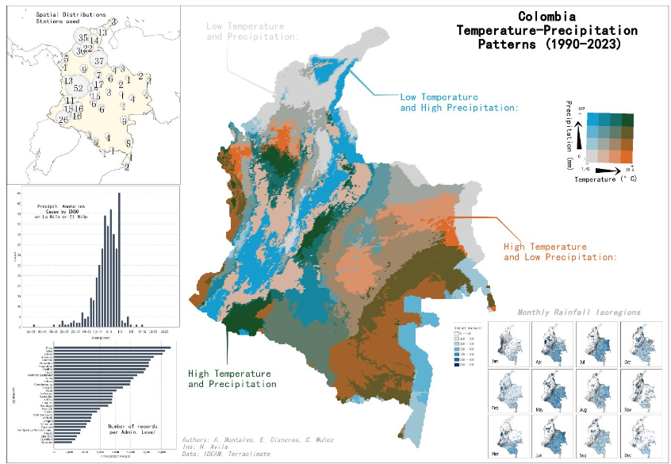

# 🏆 SuperMap 2024 Award-Winning Project: Bivariate Analysis of Temperature and Precipitation in Colombia

## 🌍 Project Overview

This repository contains the geospatial data and analysis for bivariate mapping of Colombia's temperature and precipitation trends from 1990 to 2023. The project utilizes Level 3 satellite-derived datasets (Terraclimate and CHIRPS) alongside official gauge station data from IDEAM to perform a comprehensive spatial analysis. This project won the **🏅 SuperMap 2024 Analysis Category Award**.
## Final Map Contest Winner

## 📊 Data Sources

The data used in this project comes from multiple sources:

- 📌 **IDEAM (Instituto de Hidrología, Meteorología y Estudios Ambientales de Colombia)** – Official rainfall and temperature records.
- 🗺️ **IGAC (Instituto Geográfico Agustín Codazzi)** – Administrative boundary shapefiles.
- 🌊 **NOAA (National Oceanic and Atmospheric Administration)** – Oceanic Niño Index (ONI) for macroclimatic influences.
- 🌡️ **Terraclimate (University of Idaho)** – Monthly climate and water balance datasets accessed via Google Earth Engine (GEE).
- ☔ **CHIRPS (Climate Hazards Center InfraRed Precipitation with Station Data, Version 2.0)** – Precipitation datasets accessed via GEE.

## 🔧 Data Processing

This project includes two Jupyter Notebooks for data processing:

1. 📑 **Data Processing/Supermap_GaugeStationAnalysis.ipynb** – Cleans and integrates IDEAM station data with macroclimatic indices.
2. 🛰️ **Data Processing/Supermap_BivariateClass_Terraclimate_CHIRPS.ipynb** – Downloads, processes, and visualizes raster data from Terraclimate and CHIRPS using Google Earth Engine.

### 🛠️ Required Python Packages:

- `geopandas`
- `rasterio`
- `geemap`
- `pandas`
- `numpy`
- `seaborn`
- `duckdb`
- `matplotlib`

## 🚀 Usage

Run the Jupyter notebooks in the `notebooks/` directory to reproduce the analysis.

## 📖 References

For additional details, refer to:

- 📄 `Data_Description.pdf`
- 📄 `Appli_AlexanderMontalvo_Report.pdf`

## 📜 License

[MIT License](LICENSE)

